# CS 124 Lab 4 Design Document

CS 124 Interaction Design Lab 4: To-do App UI Design (Multiple Lists, Accessible, Responsive)

Link to app: [https://cs124-lab3-9c4c8--pr2-lab4-vmue0zo5.web.app](https://cs124-lab3-9c4c8--pr2-lab4-vmue0zo5.web.app)

## Final App: Home Page

As our app currently stands, this is how the Home Page for an existing user would look. We decided to give users the ability to create multiple lists, since users might want to sort tasks into separate lists based on what category of tasks they belong to (for example, Homework versus Shopping).

The circular plus icon in the bottom right corner allows users to create a new list of tasks. We decided it wasn't necessary for the plus icon to be accompanied by any instructive text because during usability testing, participants didn't have trouble comprehending the purpose of a plus icon without text, as we explain further in the usability testing section below.

In order to save space, we decided not to display the search bar in a fixed position just under the top navigation bar. Instead, upon being tapped, the magnifying glass icon in the top right corner expands to a search bar that fills the entire top navigation bar. This happens in apps such as Facebook, Twitter, and Instagram, so we thought that users would be accustomed to such behavior. Search results will contain lists whose names match the search, and also tasks whose descriptions match the search. During usability testing, this two-layer searching ability was something users requested. In our current design, two-layer searching is not included (users can only see names of lists); however, we plan to include this in future iterations of our app.

In Lab 2, we added an app icon and logo to our Home Page. This was to give our app more brand identity, and also to distinguish our Home Page from other pages of the app.

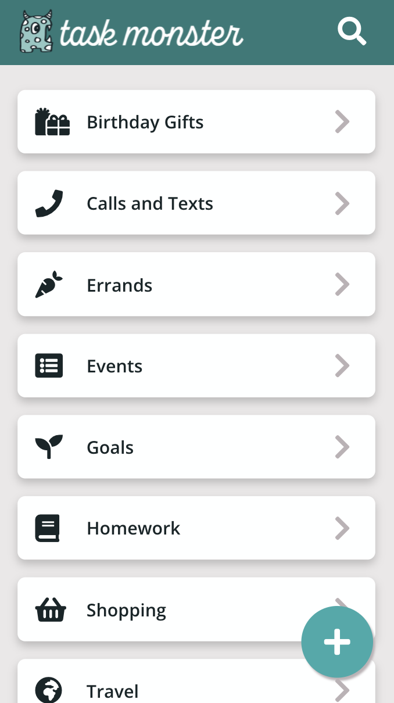

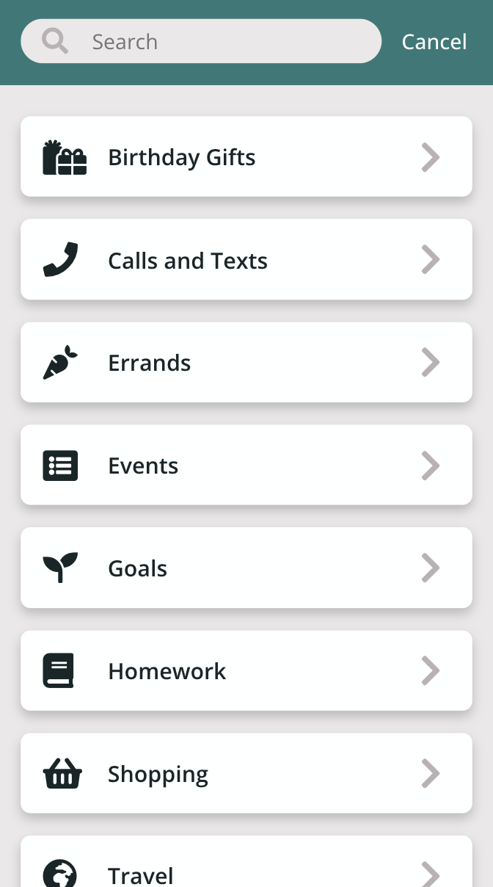

Users should tap a card for an individual list in order to get to the Single List Page, which will display all the tasks for that list.

Users should swipe from right to left on the cards for individual lists in order to reveal the pencil icon and the trash can icon for editing the list and deleting the list, respectively. We believed this swiping motion would be intuitive because it was something users are already accustomed to from their interactions with other mobile apps. But that hypothesis was somewhat refuted by our user testing for Lab 2. Most of our Lab 2 user testing participants weren't able to discover the edit and delete icons on the Home Page task cards. However, there are other more straightforward ways of editing and deleting a list that those users had no trouble finding. Since it doesn't interfere with how the average user interacts with our app, we decided that we could keep this swiping action for revealing the edit list and delete list icons as a shortcut for power users. The Zen of Palm reading talks about how it's okay to have shortcuts just for power users, as long as they don't get in the way of users who aren't experts.

After Lab 2 user testing, we also decided that at most one list should be in edit mode at any given time. That is, if a list is in edit mode and the user swipes left on another list, the new list will be put into edit mode and the old list will automatically be moved out of edit mode. This reflects the design of apps like Apple's Reminders App and Todoist.

In Lab 2, we also decided to add a deeper shadow to a task card when it has its edit and delete icons revealed. That deeper shadow distinguishes that particular task card from all the others. This conforms with a lesson from Chapter 5 of The Design of Everyday Things: “Make the item being acted upon more prominent. That is, change the appearance of the actual object being acted upon to be more visible: enlarge it, or perhaps change its color” (205).

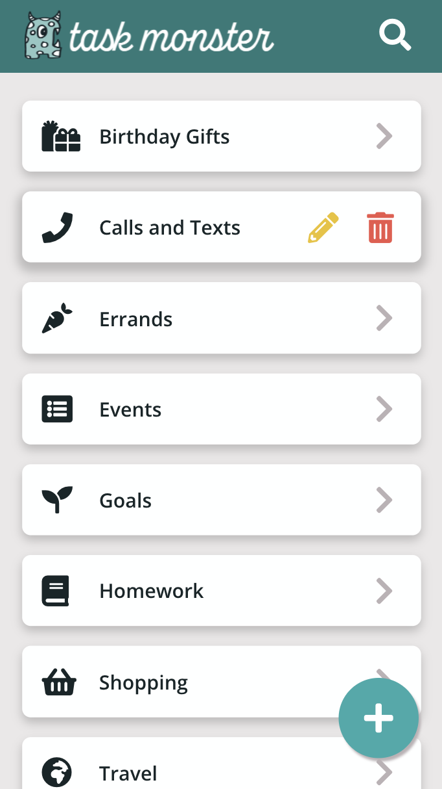

In Lab 3, we added a message that appears on the Home Page when no lists are present. We saw this idea in the grading rubric for Lab 2 and thought it would be informative and useful for our users, since it would help users realize the screen is empty because they have no lists (as opposed to no lists being shown because data is being fetched). In user testing, participants also requested a message like this when there are no lists present.

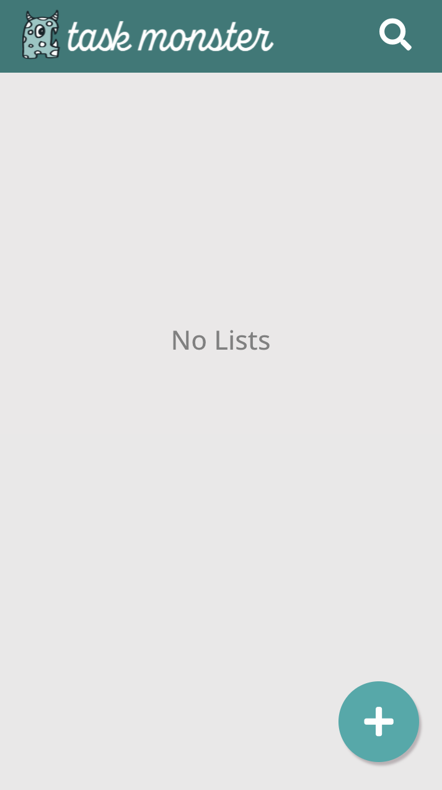

Additionally, because we're using Firebase to store our data in Lab 3, it takes a bit of time to load data from the database. Thus, we wanted to make sure our app showed a loading screen while data was being fetched. We decided a screen with a spinning wheel or other icon would look too busy, especially because it typically would only be flashed on the screen of a brief moment. Thus, we created an empty version of the homescreen to display while data is loading. While this screen normally only appears for a fraction of a second, we still think it improves the experience of using the app while data is loading in.

## Final App: Create List Page / Edit List Page

When a user taps the plus button on the Home Page, they will be brought to the Create List Page, where they can enter a list name into the input box in the top navigation bar, and also select an icon to represent their list. We wanted to give users a way to customize the appearances of their lists to their liking. The X icon cancels the action of creating a new list, while the checkmark icon saves the newly created list. This is similar to behavior seen in apps such as Google Calendar, when users edit Calendar Events on mobile devices. The checkmark icon is only enabled after the user has named their list and given it a representative icon.

During usability testing for Lab 3, we noticed that there was no autofocus on the list name input textbox on the Create List Page. So, we corrected that in Lab 3, saving users a click.

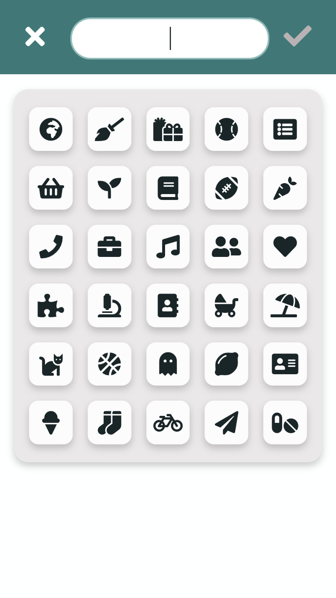

## Final App: Single List Page

When a user taps the card for an individual list on the Home Page, the user will be brought to the Single List Page, which displays all the tasks in that list, sorted primarily by priority and secondarily by deadline, as well as a magnifying glass that can be tapped to unfurl a search bar for filtering through the tasks in that list. We thought it would be helpful to have the option to attach dates to tasks in case users want to perform specific tasks at specific times / dates. We also thought the search functionality would be helpful in case there are many tasks in a single list.

The circular plus icon in the bottom right corner of the Single List Page serves a similar purpose to the plus icon on the Home Page. But instead of creating a new list, the plus icon now enables users to add a new task.

In Lab 1, we had the search bar appear automatically across the entire screen upon entering the Single List Page. However, for Lab 2, we decided to make the search bar only appear across the screen when the user taps the magnifying glass icon. This makes the design of the Single List Page more consistent with the design of the Home Page. We also considered the 80/20 rule discussed in The Zen of Palm reading: for 80% of users, any given list will probably be short, so most users won't default to using the search option to find a particular task. Rather, most users will scroll through the Single List Page to find the task they're looking for. Having a search bar across the width of the entire screen would just unnecessarily take up space for most users.

In Lab 1, we also had a pencil icon for each task that would bring the user to the Edit Task Page for that task. However, for Lab 2, we decided to remove the pencil icons from the task cards on the Single List Page, because we wanted users to go through a two-step flow of first tapping on the task card to get to the View Task Page, and then clicking an edit icon on the View Task Page to get to the Edit Task Page. With such a two-step flow, it would be harder to accidentally edit tasks. Having pencil icons on the task cards on the Single List Page would be contradictory to that two-step flow. Also, removing the pencil icons helps our app better follow the 80/20 rule from The Zen of Palm reading. 80% of users tapping on a task probably just want to look at the task details; very few probably want ot edit the task. Removing the pencil icons makes our app less cluttered, while taking care of the majority of our users.

Another Lab 2 change we made was to place completed tasks at the bottom of the list to which they belong. This was a direct result of user testing. One of our user testing participants suggested this feature, and we thought it would be quite reasonable, since the majority of users want to view their incompleted tasks, not their completed tasks. We also added a strikethrough for completed tasks after researching how other todo apps (such as Todoist) display completed items.

For Lab 2, we also restyled our checkboxes so that they would better cohere with the aesthetics (in particular, the color scheme) of our app.

In Lab 3, to better distinguish completed tasks from tasks to be done, we grayed-out completed tasks. We also added a header for "Completed" tasks. Apps like Microsoft's To Do app separate completed tasks from incomplete tasks, and we thought this would be useful for our app. The "Completed" header only appears when the list has completed tasks.

We also restyled checkboxes to match the color of the corresponding task's priority. This choice was based on researching how other apps (Todoist, Microsoft's To Do app, Apple's Reminders app) style checkboxes.

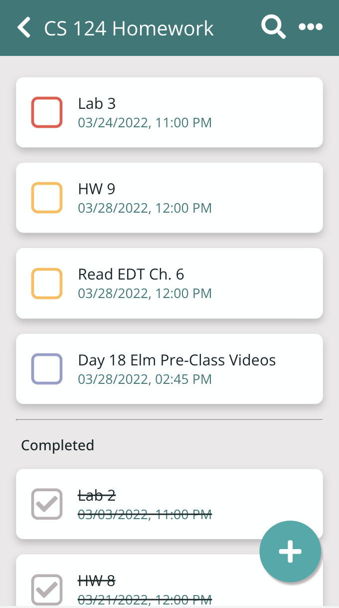

Users can tap the 3 horizontal dots in the top right corner of the Single List Page to enter the Single List Page's Menu Mode, where they can customize the list appearance by going to the Edit List Page (which is basically the same as the Create List Page), hide / show completed tasks, delete completed tasks, delete all tasks, or delete the list.

Initially, we had the delete options appear directly on the Single List Page; they were not hidden in this menu mode. However, during usability testing, participants remarked that having the "Add New Task" and "Delete All Tasks" buttons so close to each other would lead to unwanted accidental deletes. That's why we decided to add this extra layer of tapping the 3 dots to enter the Single List Page Menu Mode.

Similarly, we initially had our "Hide completed tasks" filter appear directly on the Single List Page. However, that took up a lot of space, so we decided to put it in this menu so that we could display more tasks onscreen.

In Lab 1, we had the same trash can icon for all three delete actions in the Single List Page Menu Mode: delete completed tasks, delete all tasks, and delete list. However, since each action is distinct, we thought it would be confusing to users for all three actions to share the same visual representation. So, for Lab 2, we gave each of these delete actions a unique icon.

In Lab 3, we added task sorting options, so we expanded the Single List Page Menu to contain a "Sort" row.

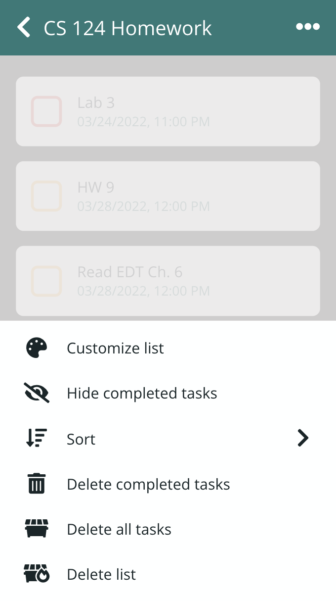

We initially put all our task sorting options in the general Single List Page Menu, but soon realized that made the menu too cluttered (see Alternate Designs below). So, we ultimately decided to create a separate sorting menu for the Single List Page that could be easily accessed from the general Single List Page Menu. Clicking either the icon or the sort option description changes the sorting method to the one selected. The checkmark indicates the current sorting method. Clicking the back arrow takes users back to the general Single List Page Menu.

However, unlike with the sorting options, we decided not to add a separate delete options menu. That's because, during usability testing, users said a separate delete options menu wasn’t necessary, and also indicated that they wanted to be able to delete tasks quickly. Adding a separate delete options menu would have meant that users would have had to make another click in order to perform a delete action. In future labs, we hope to see if more user testing confirms our findings from this round of user testing.

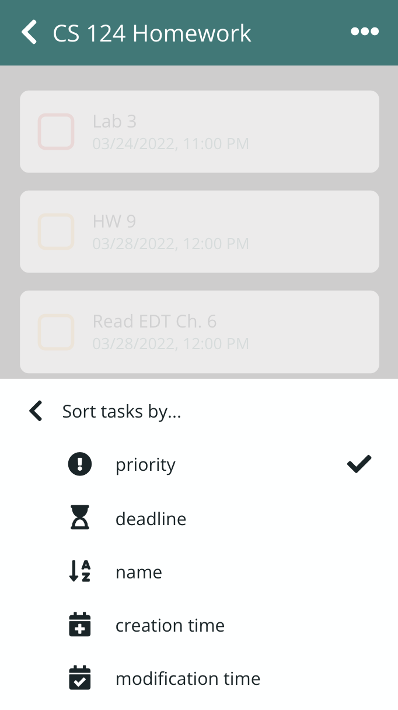

By default, tasks are sorted by priority. For sorting by priority, we used a Firebase compound index so that the tasks would primarily be sorted by priority and then secondarily sorted by deadline, since we didn't want the tasks to be disorganized within each priority level. Our reasoning was also that if a user is sorting by priority, they probably care more about the task's deadline than its name, creation time, or modification time.

Here are what the Single List Page looks like using the other sorting methods: deadline, name, creation time, modification time — in that order. Notice that completed tasks always remain at the bottom, no matter what. However, completed tasks are also sorted by the selected sorting method.

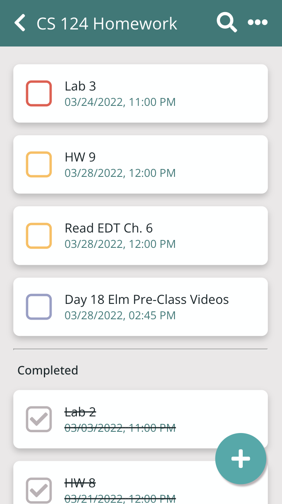

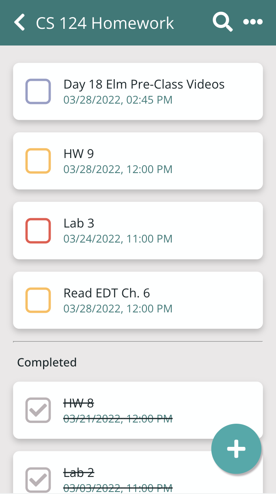

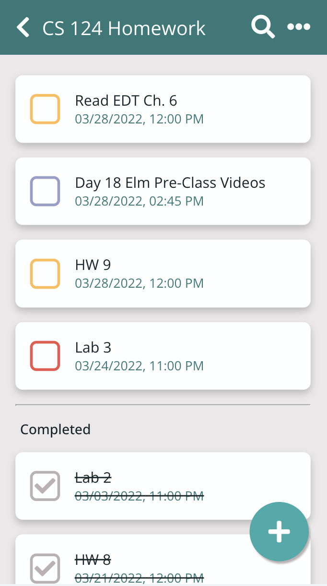

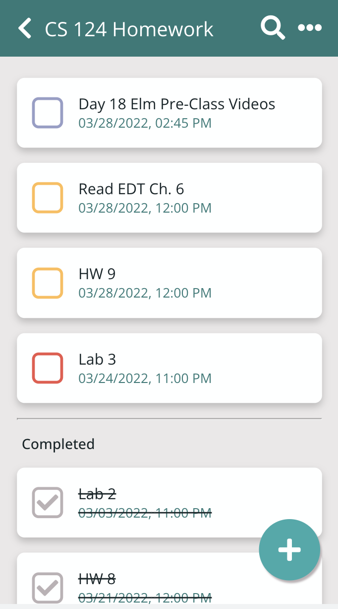

In Lab 3, we also added a message when no tasks are present or when all tasks are completed. When a list has no tasks, the message "No Tasks" will appear on the list page. In user testing, participants said they'd like to have messages like these. As with the "No Lists" message on the home page when no lists are present, this message makes it clear than an empty list is the result of having no tasks, not an error loading data.

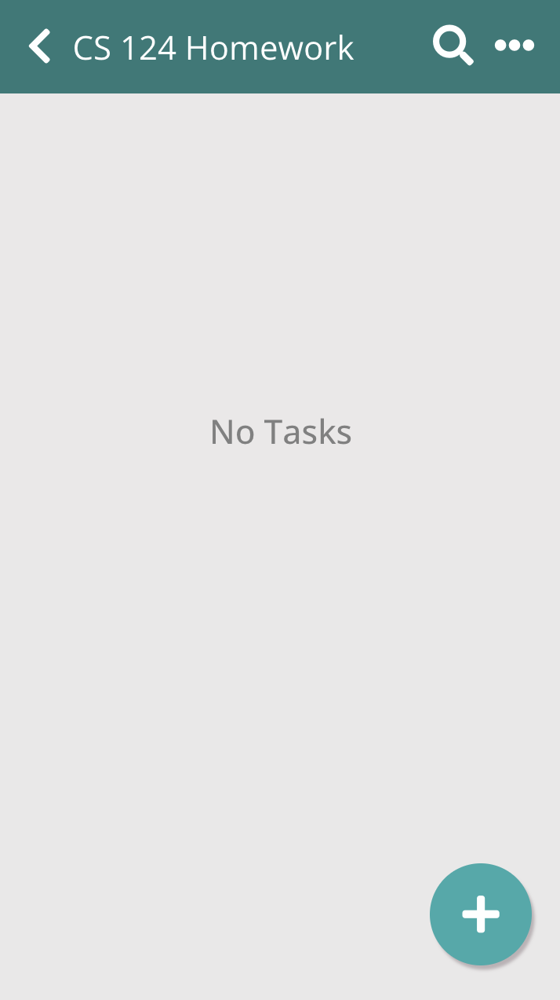

When a list has completed tasks but no incomplete tasks, a message will appear that confims the user has completed all their tasks.

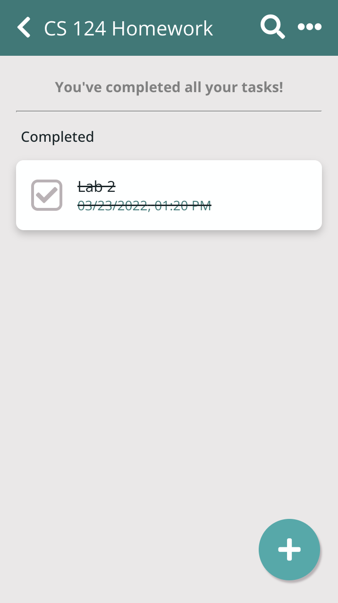
  
When opening the Single List Page, it takes a moment for data from Firebase to be fetched. Therefore, for Lab 3, we added a loading screen while task data is loading in. This screen is simply a screen showing an empty list, and it typically only flashes for a brief moment before tasks load in. Because the screen has the same background and top bar as the Single List Page with tasks, the loading is almost imperceptible when opening this page. This is a good thing, since we want opening a page to appear fluid and clean.

## Final App: View Task Page

When a user taps the card for a task on the Single List Page, they are brought to the View Task Page, where they can view more details about that task, such as additional notes, which aren't visible on the Single List Page of all tasks.

Users can tap the back arrow to return to the Single List Page of all tasks in the list. Or, alternatively, they can tap the pencil icon to go to the Edit Task Page. This was inspired by Google Calendar, which has a similar mobile user flow. The two-step user flow prevents users from accidentally editing a task when all they want to do is just to view that task.

In Lab 1, we had an X icon for returning to the Single List Page from the View Task Page. For Lab 2, we changed that X icon into a back arrow. Why? Our app uses the X icon to represent a cancel icon for a list or a task being edited. However, nothing is being edited when the user is on the View Task Page. We did not want to confuse users by using icons inconsistently.

Also, in Lab 1, we had a checkbox icon indicating the completion status of the task open in the View Task Page. However, during user testing, we observed that many users actually attempted to use that View Task Page checkbox icon to edit the status of their task. That was problematic because the checkbox is disabled on the View Task Page; a user isn't supposed to edit their task while on this page. So, to reduce confusion, for Lab 2, we decided to change the View Task Page task completion status icon into icons that are used solely on this View Task Page.

In Lab 3, we added priorities for each task. In the View Task Page, the prioirity of their task is stated next to the exclamation icon. There are four priority options: no priority (default option when creating a new task), low priority, medium priority, and high priority.

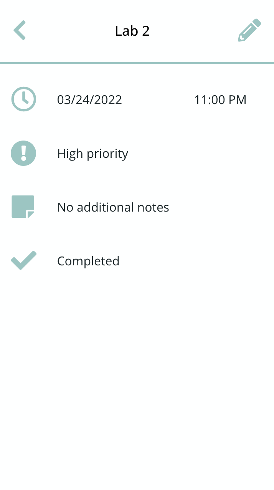

## Final App: Edit Task Page

When a user taps the pencil icon on the View Task Page, they are brought to the Edit Task Page, where they can edit the task name in the input box at the top of the page. They can also change the task date and time using dropdown menus, as well as add any additional notes, and/or mark the task as completed / not completed. Both the task name and the additional notes inputs will expand vertically as necessary, as the user types. They also both have character limits so that task names and additional notes don't get too long. Clicking the trash can icon at the bottom of the Edit Task Page will delete the task.

In Lab 3, we moved the autofocus from the "Additional notes" input box to the task name input box, based on Prof. Rhodes' advice on our Lab 2 Pull Request. This makes more sense since users must add a task name when they first create a task, and they're more likely to edit a task's name than its additional notes.

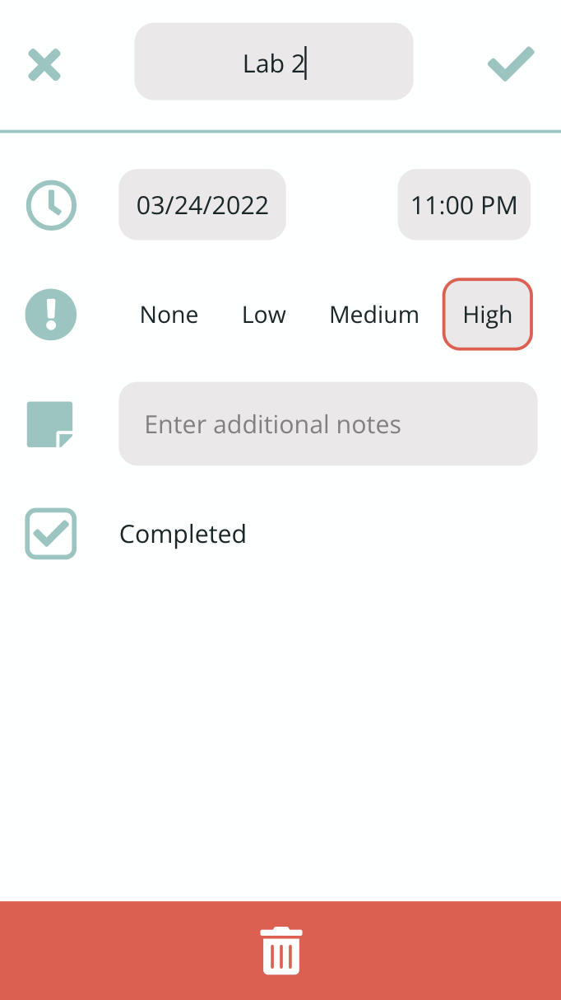

Tapping on the date field opens up a date picker. The user can either click or swipe (click and drag on a laptop) to move their desired month, day, or year into the selected area. Initially, we only allowed for the swiping motion for scrolling through the date picker. However, during user testing, the go-to action for some of our users was to click their desired month / day / year, rather than to scroll. This may have been because we did user testing on a laptop instead of a phone. Regardless, we decided to implement the additional onClick event to allow for users who default to a click action, rather than a scroll action. The date picker was a new part of our UI design introduced for Lab 2.

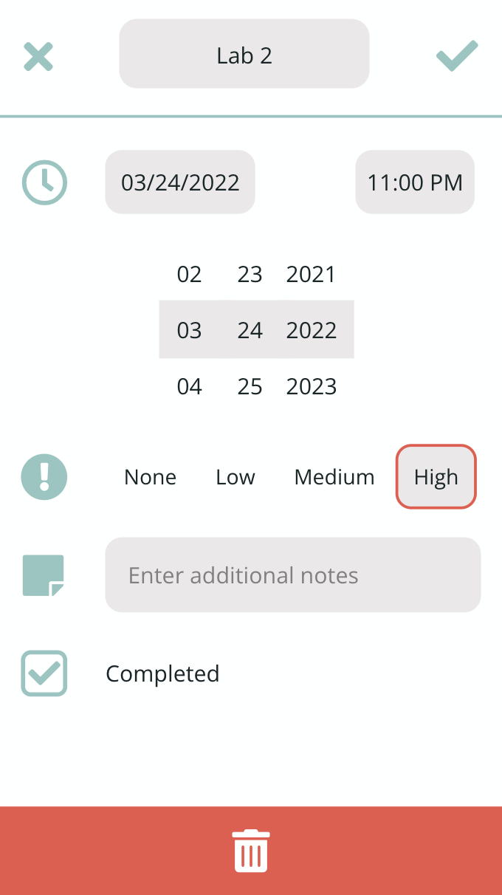

Tapping on the time field opens up a time picker. The user can either click or swipe (click and drag on a laptop) to move their desired hour, minute, or period (AM / PM) into the selected area. Initially, we only allowed for the swiping motion for scrolling through the time picker. However, during user testing, the go-to action for some of our users was to click their desired hour / minute / period (AM / PM), rather than to scroll. This may have been because we did user testing on a laptop instead of a phone. Regardless, we decided to implement the additional onClick event to allow for users who default to a click action, rather than a scroll action. The time picker was a new part of our UI design introduced for Lab 2.

In Lab 3, we added the option to include a priority with each task. To change the priority for a task, the user can tap the approriate level. The selected level will be outlined in the color corresponding to the priority as an additional visual cue of the priority. The selected priority also has a light gray background.

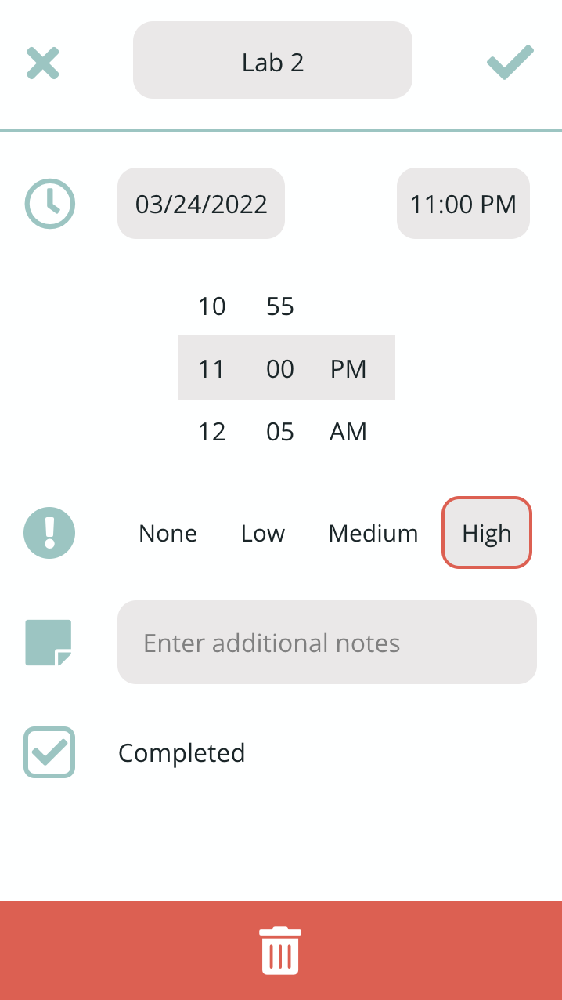

## Final App: Delete Pop-Up Confirmation Messages

For Lab 2, we introduced confirmation messages that would pop up when a user clicks a delete button. During user testing, one of our participants accidentally deleted a task and remarked that it would have been nice to have an extra warning to prevent that from happening. We thought that was a great idea, and now have confirmation messages whenever a user clicks a button to delete a task, delete completed tasks in a list, delete all tasks in a list, and delete a list.

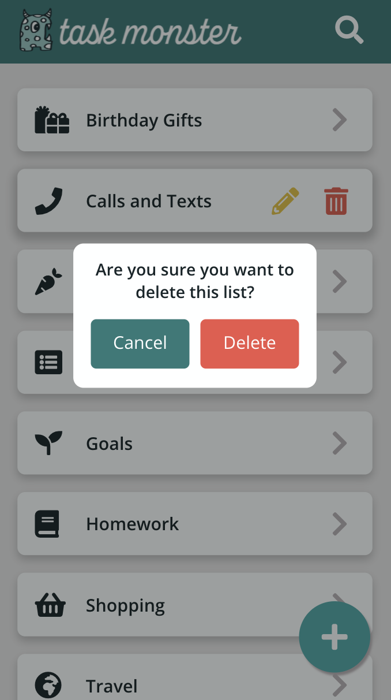

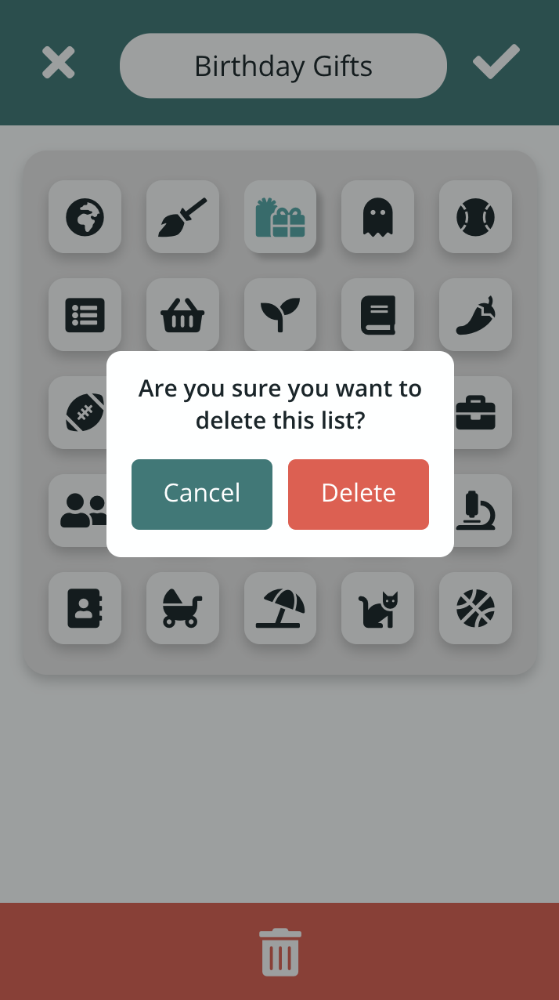

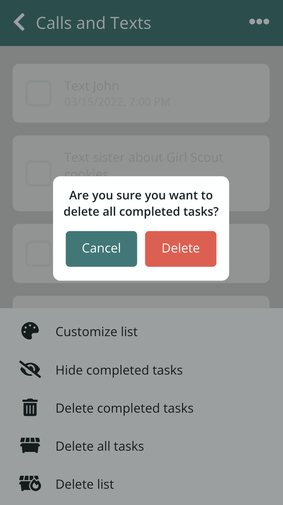

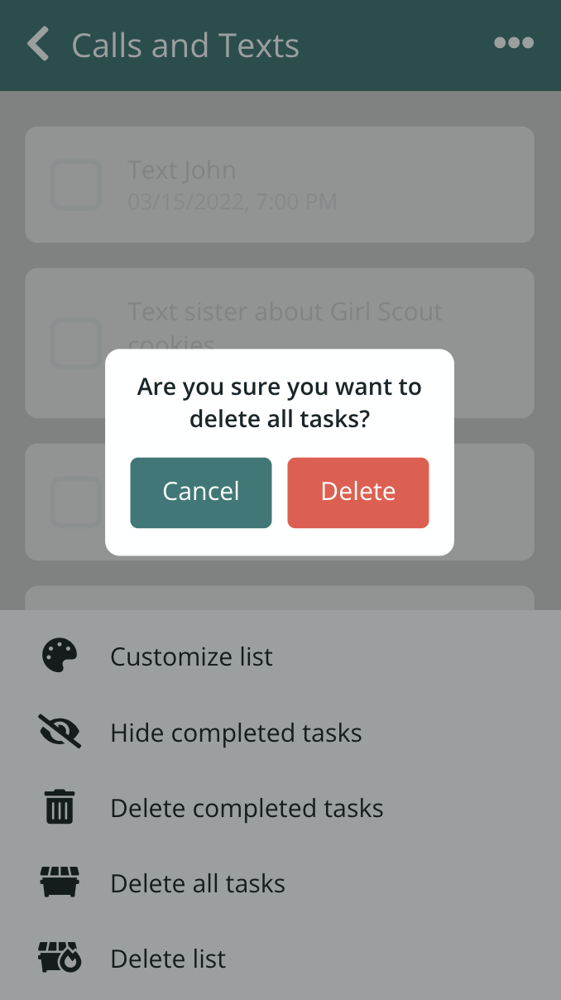

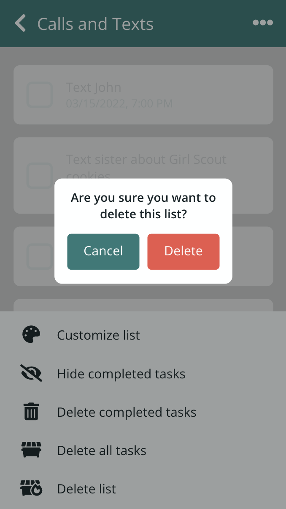

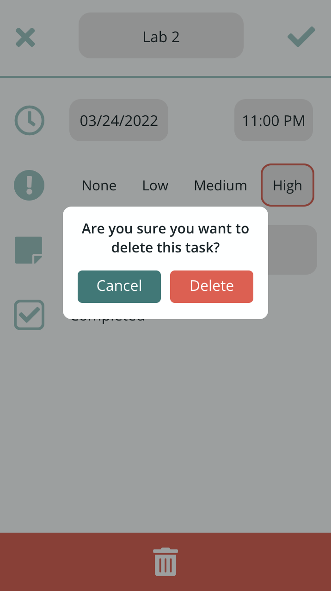

## Final App: Report Error Pop-Up Message

For Lab 3, we introduced a Report Error Pop-up whenever Firebase reports an error loading list data. The user then has the opportunity to report the error. Pressing the report button will log the error in our database, and the user will be notified that their error was reported.

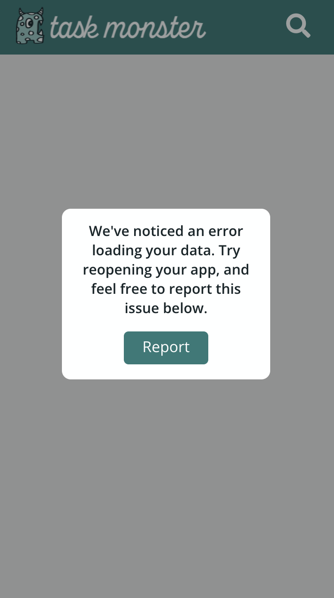

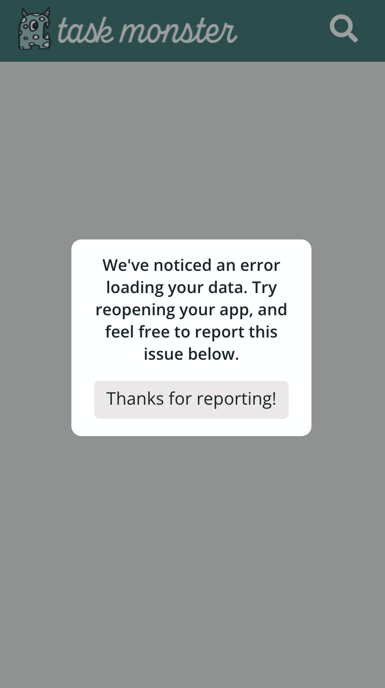

## Final App: Large Screen UI Design (Responsiveness)

In Lab 4, we made our app responsive, providing support for phones, laptops, and desktops of all sizes, as well as portrait and landscape modes. To take advantage of the increased space on devices with larger screens, we created a new UI for screens with a minimum width of 769px and a minimum height of 690px.

Here is the welcome page of our app on large screens.

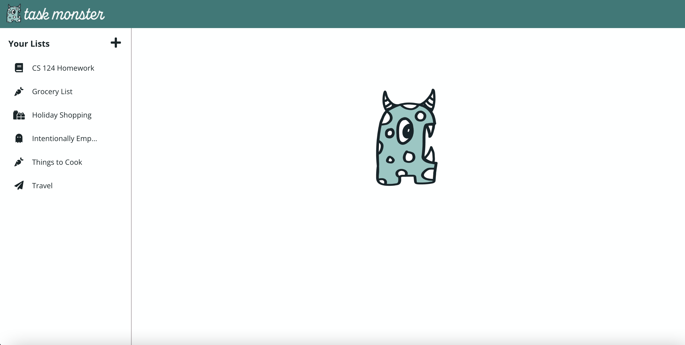

## Alternate Designs: Home Page and Single List Page Initial Brainstorming

The drawing on the left shows our initial Single List Page design, and the drawing on the right is our initial Home Page design.

We originally wanted each Home Page list to have horizontal griplines that users could use to reorder the lists. However, we later decided that icons as visual representations of the lists were more of a priority. So, our current app does not have the gripline feature. We may provide users with the ability to reorder lists in the future.

Also, we original planned to use 3 dots on each list card to reveal more options for editing each list. However, we later decided that having a right arrow icon would be more intuitive to users (since the arrow would indicate that they should swipe to reveal more options).

We initially placed the "create new list" plus button in the top navigation bar of our home page, but later decided that it would be more intuitive to add a new list after all existing lists, so we ended up placing the plus button in the bottom right corner of our app.

For the Single List Page, we originally wanted to give users sort and filter functionality directly on the page, instead of in a menu mode version of the page. However, we later discovered that sort and filter would take up too much space and prevent users from seeing a maximal number of tasks at once. So, we decided not to implement sorting (at least temporarily), and to hide the filter by completion status functionality in the Single List Page's menu mode.

Also, we originally intended to locate the "delete completed tasks" / "delete all tasks" buttons directly on the Single List Page, but received feedback from user testing that users were scared of accidentally hitting the delete button while scrolling to see more tasks. So, we decided to hide the delete functionality in the Single List Page's menu mode as well.

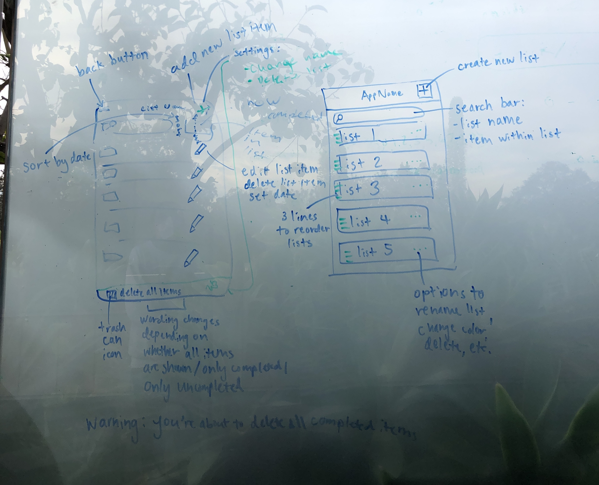

## Alternate Designs: Home Page

This is the first version of our Home Page that we coded up. It uses the font Karla instead of Open Sans. We decided to use Open Sans instead because it is a cleaner font that would be easier to read.

This version of our app also uses a different color palette. After listening to Dr. Milburn's presentation on design, we decided to revise our color palette to better reflect the energy and connotations that we wanted our app to have.

This Home Page also has two plus buttons: one plus button in the top right corner, and one at the bottom. They serve the same functionality, which Prof. Rhodes found to be confusing. So, we decided to just consolidate the two buttons into a single button in the final version of our app for Lab 1.

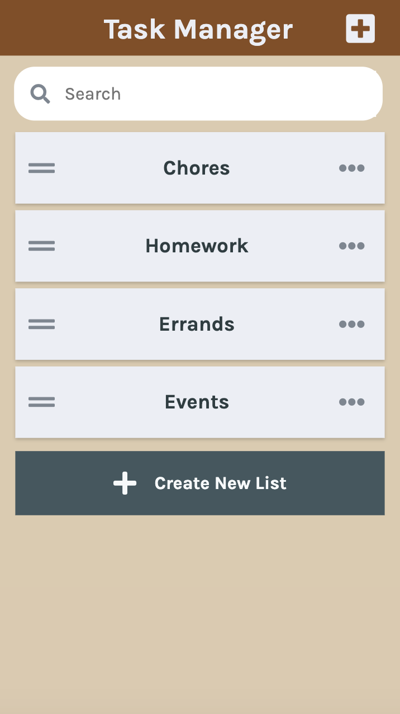

This is the second version of our Home Page that we created. As mentioned above, we decided to house the search bar within the top navigation bar to save space. And we also decided to de-prioritize the griplines for reordering the lists. User testing told us that it was not necessary to spell out the functionality of the plus button, so we removed the "Create New List" text in the final version of our Home Page for Lab 1.

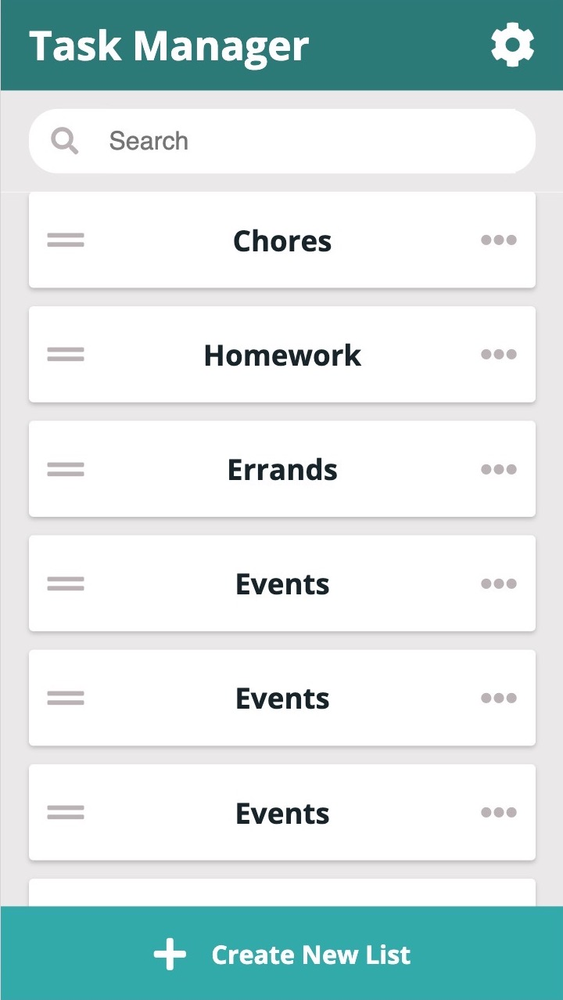

This is the version of our Home Page that we turned in for Lab 1. As mentioned above, in Lab 2, we decided to add a deeper shadow to a task card when it has its edit and delete icons revealed, in order to distinguish that task card from all the others.

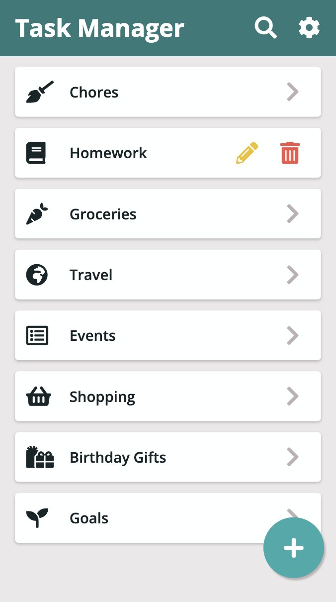

This is the version of our Home Page that we turned in for Lab 1. This version of our home page had neither an app icon nor a logo. We remedied that in Lab 2.

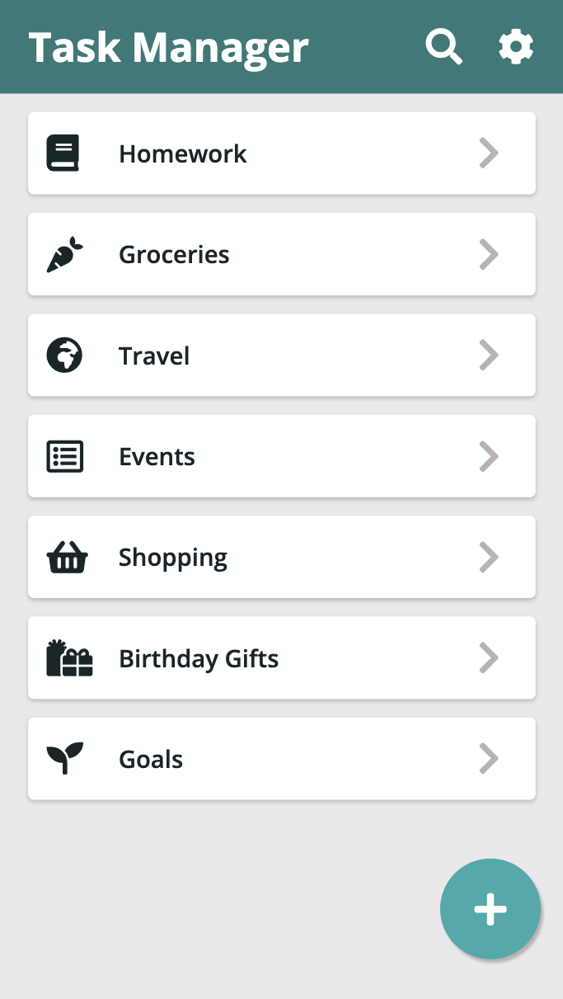

## Alternate Designs: Create List Page / Edit List Page

Initially, there was no autofocus on the list name input textbox on the Create List Page / Edit List Page — as shown below. We added an autofocus after we noticed that during Lab 3 usability testing.

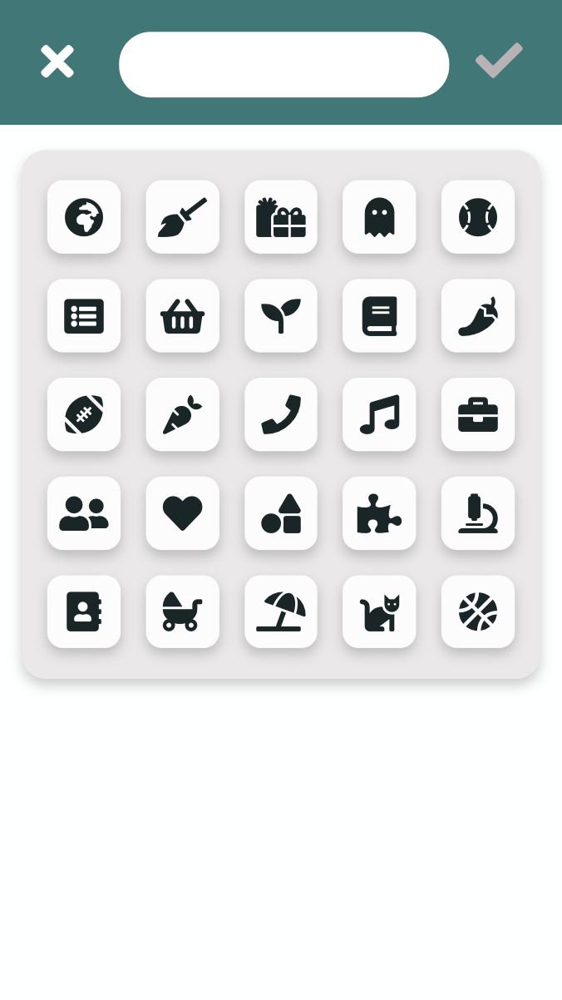

## Alternate Designs: Single List Page

This is the first version of our Single List Page that we created. As mentioned above, we later decided to save space by putting the hide completed tasks behind a Single List Page menu mode, and to reduce the chances of users accidentally deleting all tasks by placing that functionality in the menu mode as well. We'll discuss this in more detail in the usability testing section below.

In our final Single List Page, we decided to decrease the font weight to give our app a more sleek feel. We also decided to place the back button on the left side of the top navigation bar, since that is a more intuitive position for a back button, in addition to replacing the home icon with a left arrow back button more evocative of the right arrow button that users would see on the Home Page.

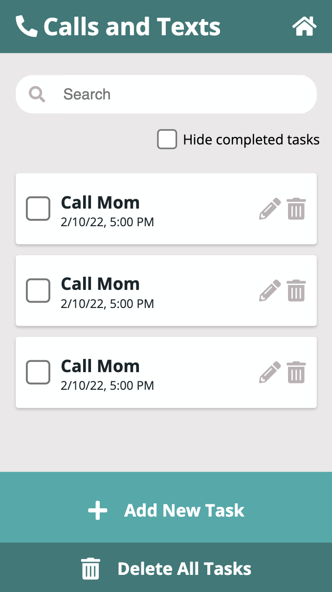

This is the version of our Single List Page that we turned in for Lab 1. As mentioned above, in Lab 2, we decided to hide the search bar behind a magnifying glass icon so that the Single List Page's design would be consistent with that of the Home Page, and also so that the search bar would not take up so much space on the Single List Page.

Furthermore, we also decided to remove the pencil icons from the task cards on the Single List Page for Lab 2 because we wanted it to take two steps to get to the Edit Task Page from the Single List Page, rather than just one step. Having an extra step to get to the Edit Task Page would help prevent users from accidentally editing tasks.

And as you can see, our checkboxes for Lab 1 were styled a bit oddly. So, for Lab 2, we changed the look of our checkboxes to better adhere to the aesthetics of our app.

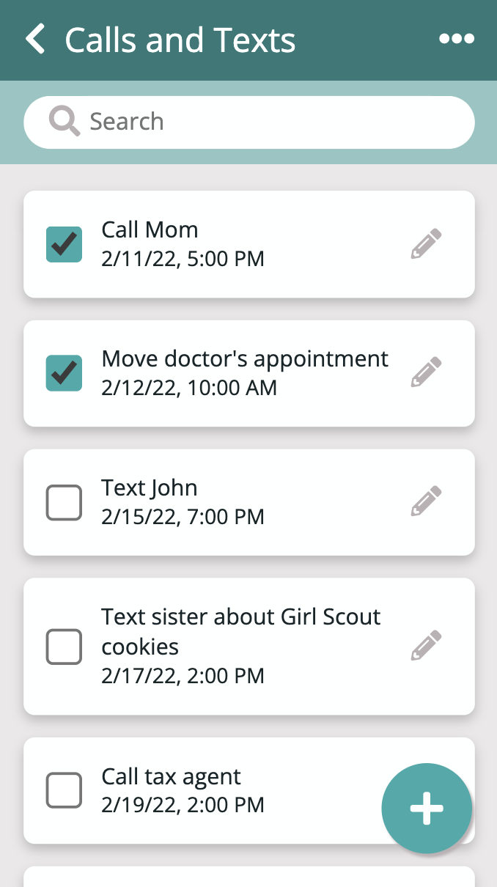

Below is what our Single List Page looked like for Lab 2. Our incomplete tasks and completed tasks were not as distinct as they could be. So, in Lab 3, we made the checkboxes for completed tasks gray, and we also added a header for completed tasks.

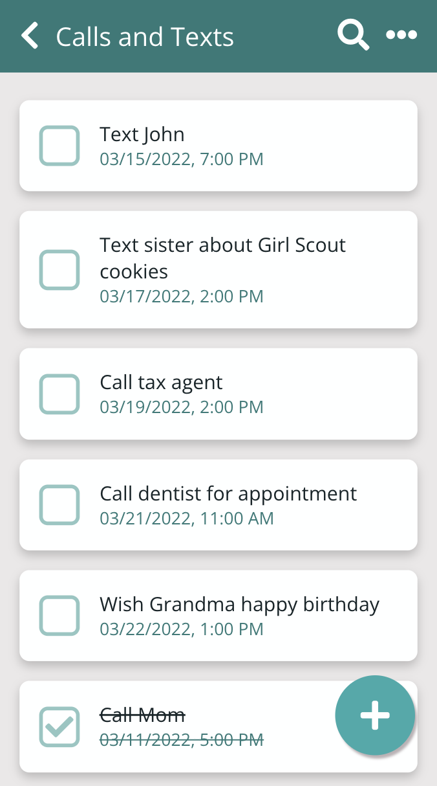

## Alternate Designs: Single List Page Menu Mode

This is the version of our Single List Page Menu Mode that we turned in for Lab 1.

As mentioned above, we decided it would not be a good idea to have the same trash can icon represent three different delete actions: delete completed tasks, delete all tasks, and delete list. So, for Lab 2, we decided to differentiate these actions by assigning each action a distinct icon. In Lab 3, we introduced sorting, so we added a "Sort" row to this menu.

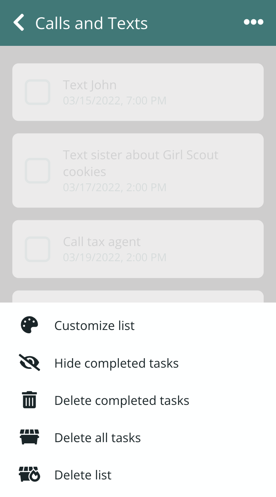

When we first tried to add task sorting options in Lab 3, we added them directly to the general Single List Page Menu — like below. However, the general Single List Page Menu soon felt very cluttered, so we later decided to move the sorting options to a separate sort menu that could be access through a "Sort" row in the general Single List Page Menu.

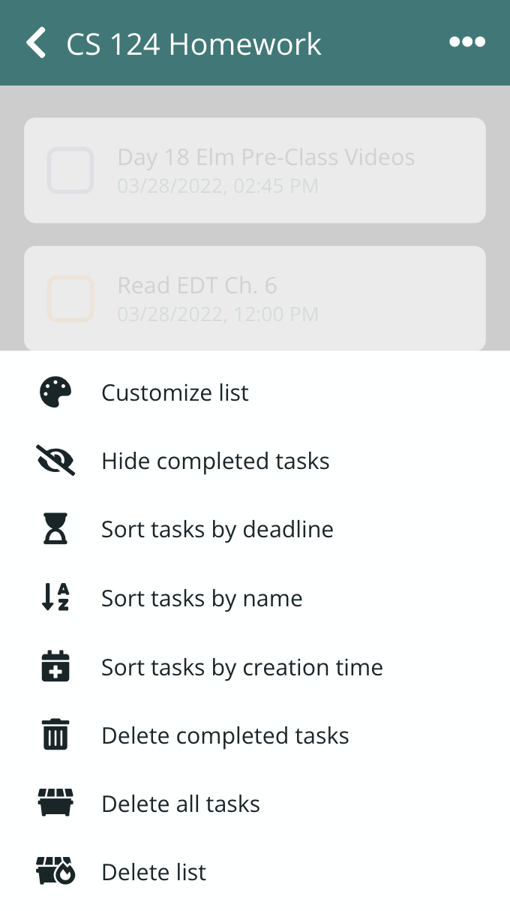

When we first implemented a separate task sort options menu in Lab 3, it looked like the image below. However, during usability testing, users mentioned that, from the sort menu, they wanted a one-click way to return back to the general Single List Page Menu. So, for Lab 3, we ultimately decided to change the layout of the sort menu to contain a header with a back arrow and the phrase "Sort by..." Only including the "Sort by" phrase in the header also allowed us to reduce the repetitiveness of "Sort by" as compared to the initial version of our sort menu seen below.

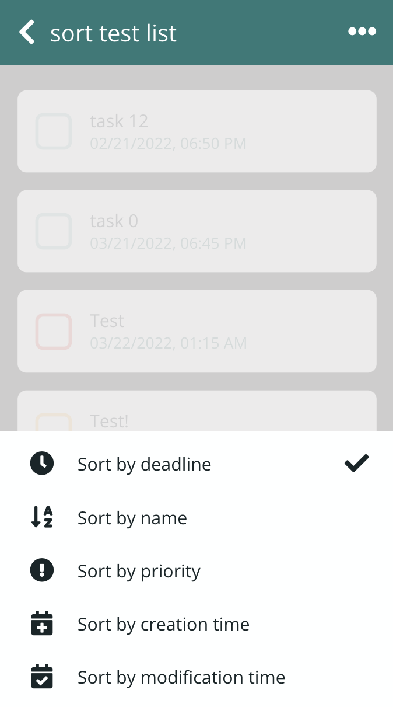

## Alternate Designs: View Task Page

This is the version of our View Task Page that we turned in for Lab 1. For Lab 2, we changed the X icon for returning to the Single List Page from the View Task Page. We made that into a back arrow instead, since the X icon would be inappropriate in this situation; the X icon signifies the cancellation of current edits, but nothing is actually getting edited on the View Task Page.

In Lab 1, we also had a checkbox icon indicating the task completion status. However, this confused many user testing participants into thinking that clicking the checkbox would actually modify the task completion status, and that wasn't the case. So, for Lab 2, we changed the View Task Page task completion status icon into icons that are used only on the View Task Page.

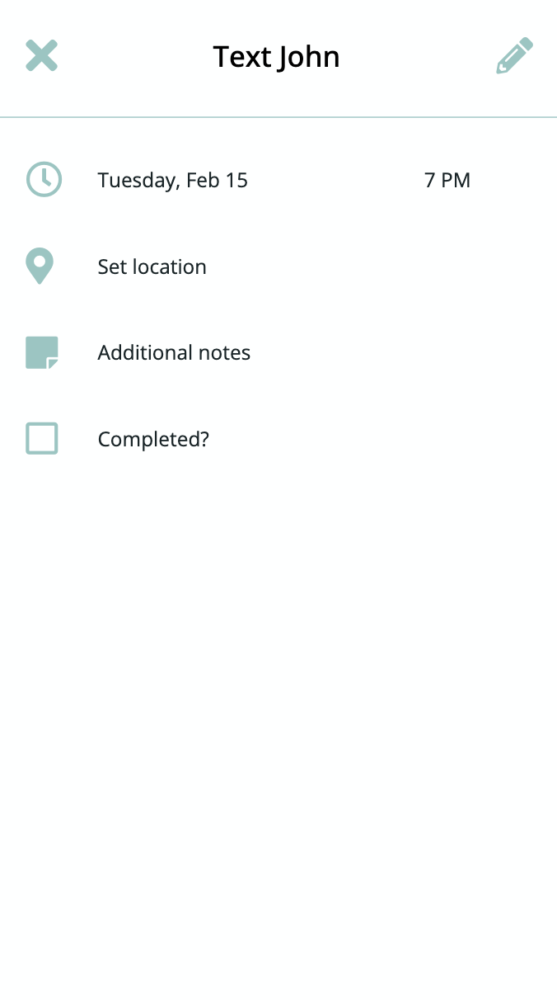

Below is the View Task Page we turned in for Lab 2. In Lab 3, we added task priority as an additional field for each task.

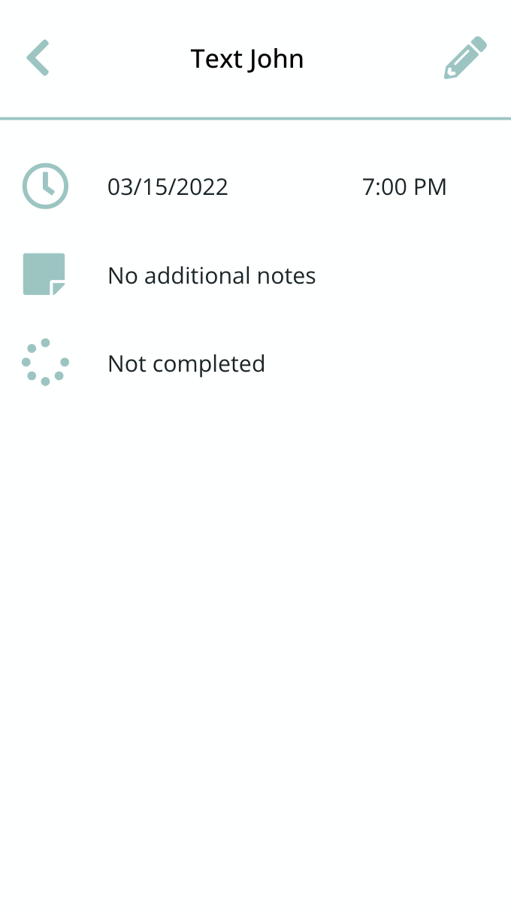

## Alternate Designs: Edit Task Page

This is the version of our Edit Task Page that we turned in for Lab 1. We fleshed out the design of the Edit Task Page further for Lab 2.

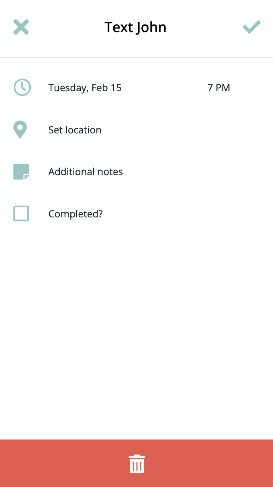

Below is the Edit Task Page that we turned in for Lab 2. In Lab 3, we added the ability to set a task's priority level. We also moved the autofocus from the "Additional notes" input box to the task name input box, based on Prof. Rhodes' advice on our Lab 2 Pull Request, and also just because that makes more sense since users must add a task name when they first create a task, and they're more likely to edit a task's name, rather than its additional notes.

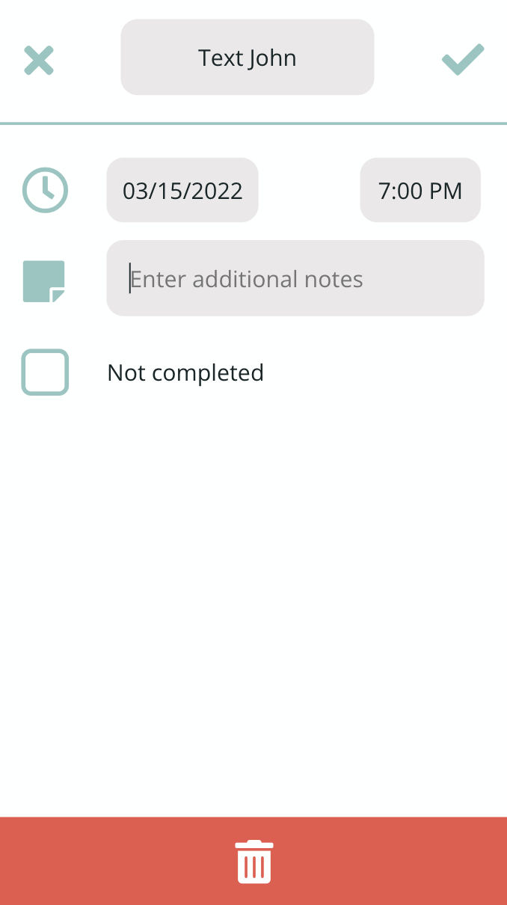

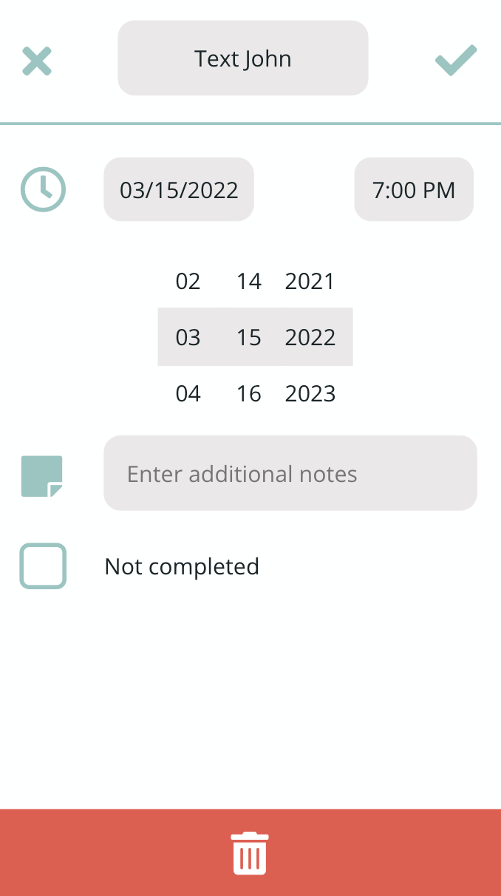

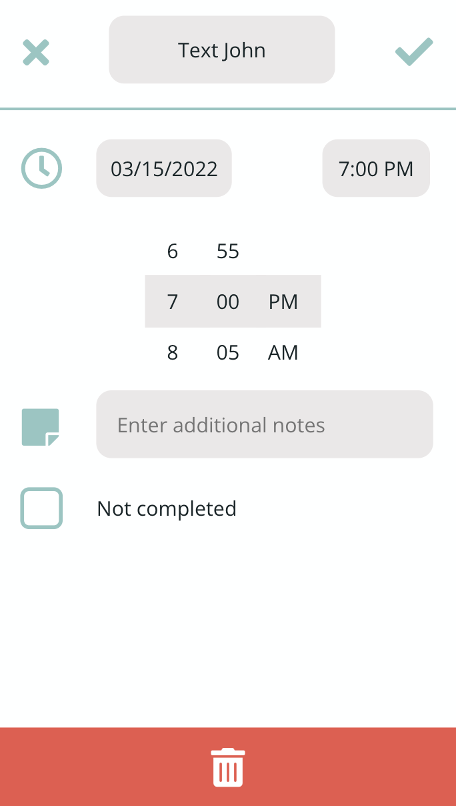

## Usability Testing: Lab 1

We conducted usability testing with four Mudd friends, asking them to tell us about their impressions of our app and how they would navigate from page to page to perform certain tasks.

### Home Page

Without any prompting, usability testing participants were able to understand that tapping the plus button would create a new list. That told us that there was no need to include text like explaining the plus icon, which we had previously believed would be necessary. So, the final version of our app does not contain text accompanying the plus icon.

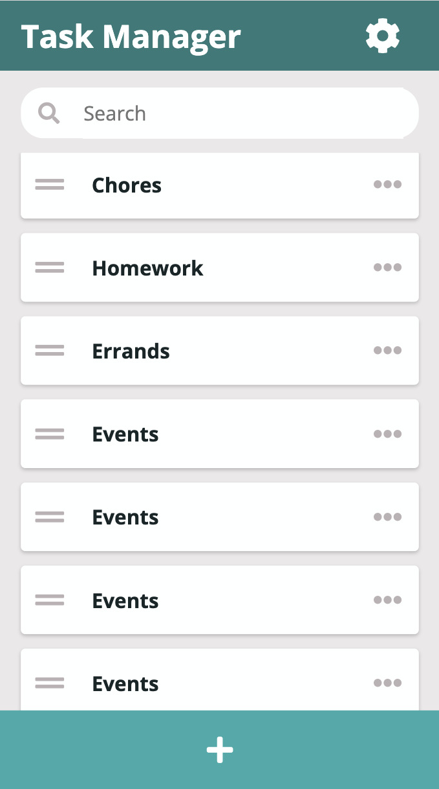

### Home Page New Version

Users understood that if they tapped an individual list, they would see more of the list (i.e., tasks contained in the list). That told us that we had a user-friendly structure with a Home Page containing multiple lists, and then Single List Pages that could be accessed by tapping lists on the Home Page.

Users understood that swiping from right to left would reveal the pencil and trash can icons. They mentioned that other apps used that same swiping motion. They also understood that the pencil icon would allow them to edit an individual list, while the trash can icon would delete the list. So, we decided to keep these features in our final version of the Home Page for Lab 1.

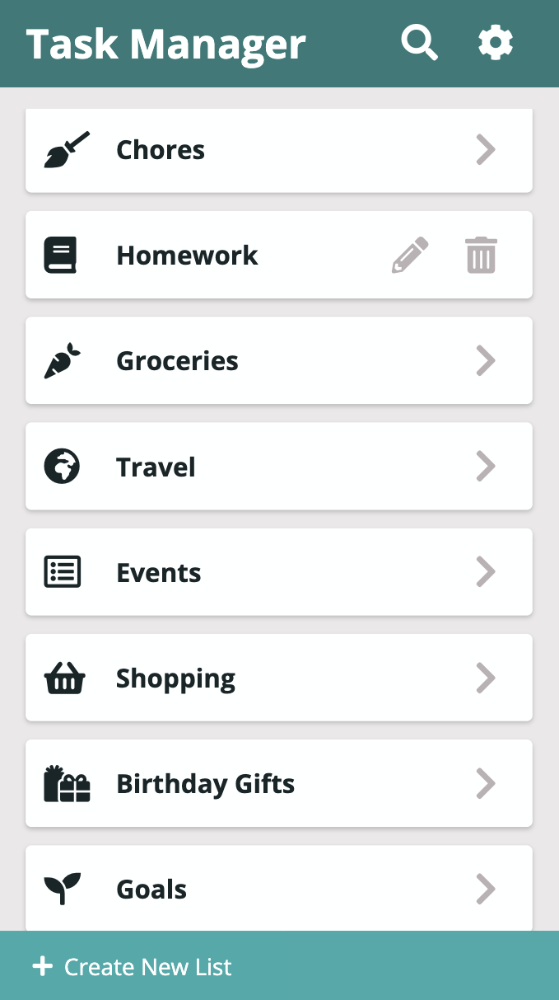

### Home Page Search

Originally, our app displayed an empty screen before users entered search keywords. However, usability testing participants told us that they wanted to see all the list items displayed on the screen, if they had not yet typed anything in the search bar, so that the search would behave like it filtered. That's why we decided to change our app so that the search starts with all lists displayed, and then gradually filters those lists as the user types their search terms.

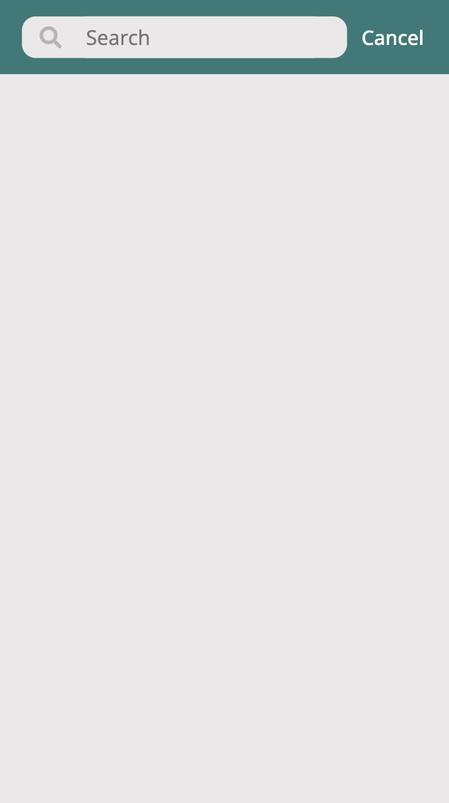

### Single List Page

Usability testing participants knew the home icon would bring them back to the Home Page, but preferred having a back icon more reflective of the arrow icon they saw on the Home Page. So, we decided to change the home icon into a left arrow icon in the final version of our Single List Page for Lab 1.

Furthermore, users did not like that the Add New Task and Delete All Tasks buttons were situated right next to each other in this first version of our Single List Page, saying that it would be easy to make a mistake and delete all tasks, when they were actually intending to add a new task. To prevent such accidents, we decided to hide the delete all tasks functionality behind a separate menu mode that users could only enter upon tapping the 3 dots in the top right corner of the Single List page.

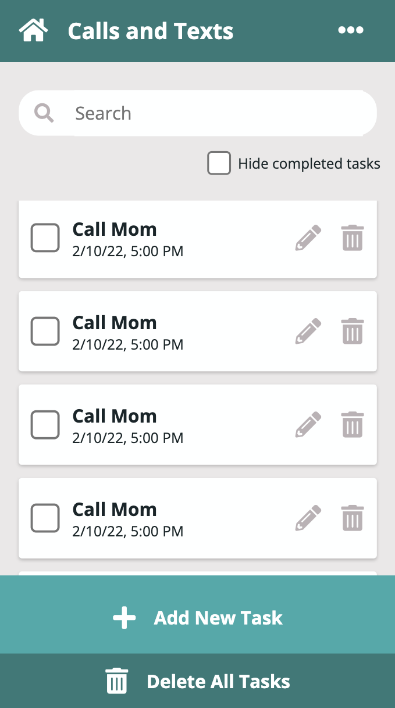

### Edit Task Page

While users understood that this page would allow them to edit a task name, date, location, notes, and completion status, they didn't see a way to get out of this page without deleting the task they were trying to edit. That was an oversight on our part. In our final design of the Edit Task Page for Lab 1, we decided to add an X icon to the top left corner and a checkmark to the top right corner of this page to allow users to get back to the Single List Page without saving their changes, or with saving their changes, respectively.

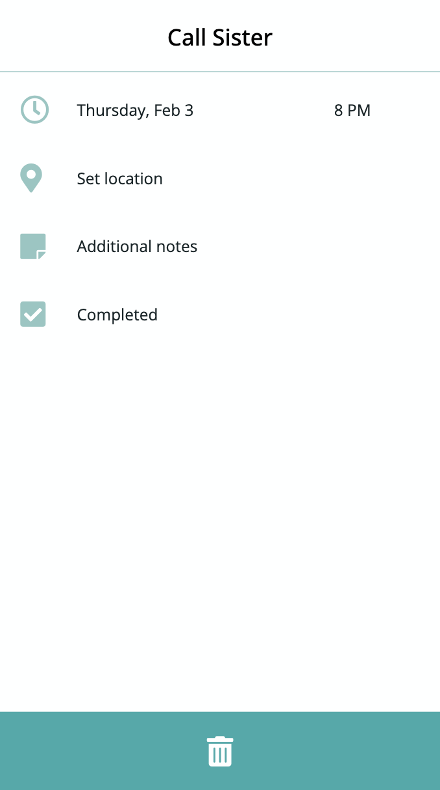

## Usability Testing: Lab 2

For Lab 2, we conducted usability testing in-person with three Mudd students and virtually (through Zoom) with a student from another school. We first asked participants to share their impressions of our app just based on the home screen. We asked what they thought our app did and what actions they thought they could perform based on viewing the page. Next, we asked participants to perform a series of tasks while thinking out loud. These tasks included creating, deleting, and editing lists and tasks, as well as searching for lists and tasks. For instance, we had hardcoded a "Calls and Texts" list with a "Text John" task into our app. We asked each user testing participant to try to change the date of the "Text John" task to April 5, 2022 at 9:15 AM.

### Home Page

All four users understood that our app was a task managing app just from looking at the home screen. They cited the name of our app ("Task Monster") and the layout of the lists on the home screen as primary reasons behind this. All users also understood that the plus icon in the bottom right corner would add a list and that the search button in the upper right corner allowed them to search for lists. Users believed the location of these buttons was intuitive. Users generally believed alphabetical sorting for the lists on the home screen made sense, but a few wanted an option to sort the lists by creation date or modification date. We added this functionality in Lab 3, along with a couple other sorting methods, such as by priority, deadline, and name. Users also understood that, to enter a list, they just have to tap on the list card.

### Home Page with List in Edit Mode

Most users did not figure out that lists could be swiped to reveal an edit and delete button, but we decided to keep this functionality for "power users," as described in The Zen of Palm reading. One user commented that it made sense that you cannot enter a list when it is in edit mode, so we decided to keep this design. One user also mentioned that they preferred having a heavier shadow around the list box when it was in edit mode, so we implemented this. A user also pointed out that they would rather have at most one list be in edit mode at any given time. This reflects what we saw in other similar apps (e.g. Apple's Reminders app), so we also made this change.

### Home Page Search

In Lab 1, users said they wanted the search input to act like a filter, such that with no input, all lists would be automatically shown. For our user testing in this lab, users said they preferred seeing all lists before entering a search query, so we plan to keep this design.

### Single List Page

Multiple users commented that, when a task is marked completed, they expected the task to be moved to the bottom of the list. In response to their feedback, we implemented this change. Users also stated that they wanted completed tasks to be greyed our or otherwise differ more from tasks that are not completed. After researching how other task apps (e.g. Todoist) display completed tasks, we decided to strikethrough the task name and date for completed tasks.

### Single List Page in Menu Mode

Users found the labels for the menu actions clear. However, all users noted that they wanted a warning when deleting a list, all tasks, or completed items. We added delete confirmation messages to our app for Lab 2.

### Edit List Page and Create List Page

One user noticed that a list name could be so long that it did not fit onto a single line, so we introduced a character limit for list names, and if the name was still above a certain width, the app would add ellipses so buttons in the top bar were not cut off. The same user noticed that an orange outline appeared around the list name field when it was being edited. This outline was not intentional and did not match our color scheme, so we instead added a light blue outline within our color scheme when the list name was being edited. Users also wanted a warning if they try to delete the list from this page, so we added this alert.

### Edit Task Page and Create Task Page

Users found the click and drag mechanism (which would translate to scrolling on a phone) with the date and time pickers a bit unintuitive, although we wonder whether their experience would have been different had they been using a phone rather than a laptop for the usability test. To accomodate different preferences for using the date and time picker, we added the option of allowing users to click on dates and times to select them directly, rather than only having the scroll option.

### View Task Page

Users were confused about why the "Completed" checkbox was not editable from this page, since the view-only checkbox looked the same as the editable checkbox. We changed the icon used to represent completed and uncompleted tasks on the View Task Page so users would understand that they could not mark a task completed from the View Task Page.

## Usability Testing: Lab 3

For Lab 3, we conducted usability testing in-person with two Mudd students and virtually (through Zoom) with a student from another school. We first asked participants to share their impressions of our app just based on the home screen. We asked what they thought our app did and what actions they thought they could perform based on viewing the page. Next, we asked participants to perform a series of tasks while thinking out loud. These tasks included creating, deleting, and editing lists and tasks, as well as sorting tasks and assigning priority levels to tasks. For instance, we asked each user testing participant to add several tasks to a new list, and then try to change the sorting method of that list to "name" and "creation time."

Users generally seemed to enjoy using our app. One user even remarked that they had the time of their life!

### Edit List Page and Create List Page

When a user was creating a new list during usability testing, we noticed that the Create List Page did not automatically autofocus on the list name input textbox. We decided to add an autofocus to the list name input textbox since users must type in a name in order to create a new list. The autofocus saves users from making an additional click.

### Delete Alert Error

When we asked a user to try deleting all completed tasks in a list during usability testing, we realized that we had introduced a bug into our app when we added a Report Error popup alert in Lab 3. The bug made it so that our other alerts had too much whitespace on the bottom. After discovering this issue during usability testing, we were able to quickly remedy it.

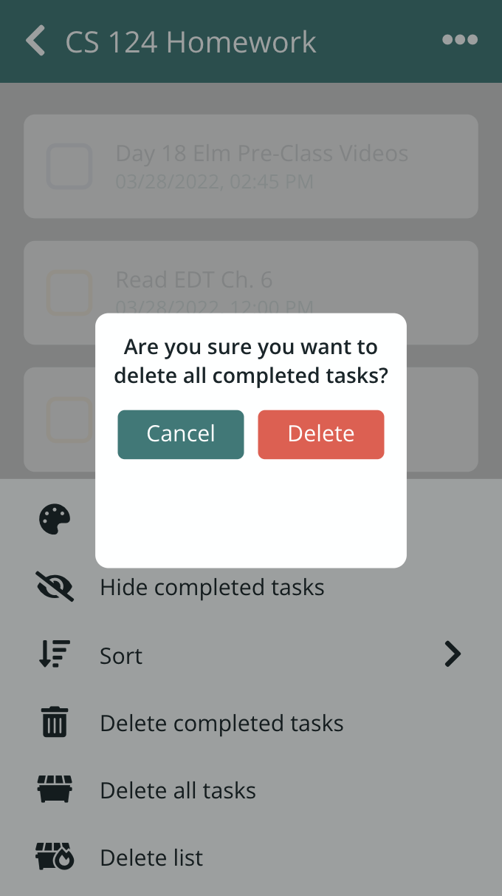

### Single List Page Menu Mode

For Lab 3, we did usability testing with a version of our task sort options menu that looked like the one below. During usability testing, users mentioned that they wanted to be able to directly go back from the sort menu to the general Single List Page Menu. So, we ultimately changed the design of the sort menu so that there would be a header with a back arrow for returning to the general Single List Page Menu.

### Messages when No Lists, Tasks, or Incomplete Tasks are Present

During usability testing, all users either explicitly requested or said they'd appreciate a message when no lists are present, no tasks are present within a list, or all tasks are completed. Because of this feedback, we added these messages to our app.

## Challenges

Here are some challenges we faced:

- Choosing a color palette proved to be more difficult than we initially thought it would be! We first tried to use the website [https://coolors.co/](https://coolors.co/) to come up with a good color palette of our own conception. However, after listening to Dr. Milburn's presentation on design in class, we realized that our color palette was pretty lacking and did not convey the right feel for our app. As you can see above, it was very brown, with neutral tones, and not very energetic or exciting. In the end, we decided to look at websites listing "best" color palettes, and work off of an existing green color palette to satisfy our app's needs.
- Although a to-do app might seem quite simple at first, coming up with a user flow for our app was harder than expected. In particular, we often overlooked functionality that users might require to navigate between different pages on the app. For instance, we initially forgot to add a back button to the Edit Task Page so that users could return to the Single List Page after editing a task.
- We wanted our app to have features like creating a new list/task, deleting lists/tasks, and filtering out completed list items. Ideally, users be able to access these features in a way that is clear and intuitive. We struggled with finding a balance between making buttons for these features visible and making our app uncluttered / preventing users from accidentally deleting items. We found that pop-up menus could work well for deleting lists and filtering, whereas it might be better to have a small, visible button in the bottom of pages for adding lists/tasks.
- CSS wasn't always the easiest to work with! We had quite a few issues trying to align elements on each page of our app, and working with CSS Flexbox and Gridbox wasn't very easy. We feel that it should be easier and more intuitive to style webpages — maybe CSS needs an update!
- When we were implementing our walkthrough, we noticed that the sizing of text and elements in our iframes was significantly different than it looked when using a 360x640 pixel portrait-mode mobile display on Chrome Developer Tools. Most fonts and icons were too large for the screen. We troubleshooted for a while but couldn't find much information online about people experiencing similar issues. We tried changing relative sizing to absolute sizing and adding extra tags to our iframes, but none of these solved our problem. After creating a Piazza post and attending grutoring (thanks, Marcos!), we discovered that the issue was with Chrome Developer Tools. Chrome autosizes fonts to fit the device window when using a device emulator. Since we styled our webpages based on how they looked in Chrome Developer Tools, all of our font sizes were influenced by autosizing. To fix this, we had to change all of our icon sizes, text sizes, and other element sizes. We also had to add a viewport meta tag to all of our HTML pages so Chrome wouldn't autosize our fonts.
- A note from Lab 3: Integrating a Firebase database into our app proved to be much harder than we thought it would be. After installing the Node packages for Firebase, we kept getting a JavaScript heap out of memory error when running `npm run start`. We had to repeat the Firebase install and deploy steps multiple times, and ultimately, we had to create a new GitHub repo from scratch in order to get things to run. Even then, we ran into an issue where no Firebase deploy action was running when we pushed to GitHub. That was probably because the branches of our first new GitHub repo were set up a bit oddly. So, we had to create another new GitHub repo from scratch to finally get everything working.

## Wins

Here are some parts of our design we're most proud of:

- We used a lot of icons as visual cues in our app. We're proud that we chose icons that would be intuitive to users (i.e. plus icon for creating a new list, pencil icon for editing a task). Icons also significantly improved the look and the aesthetics of our Home Page, as you can see the difference between our initial Home Page design and our final Home Page design above.
- We created a pop-up menu on the list page that allows the user to delete all tasks, delete completed tasks, and delete the entire list, as well as change the appearance of the list and hide completed tasks. We're proud of being able to create the menu and distinguish these similar options. We are also proud of adding a slightly opaque background behind the pop-up menu so the user can focus on the menu while still seeing the tasks on the list page.
- We are proud of how much outside research we did while creating the app. We downloaded many to-do/reminder apps on our phones and tested all of these. Through our testing, we identified common features these apps had and looked at different ways to display these features to the user. When designing our own app, we compared these implementations and determined which ones we preferred. By doing so much research, we got a better sense of what we liked in a to-do app and what we should include in our own app.
- We're also proud of all the features in our final app that were affected by usability testing, such as the solitary plus icon for creating a new list, as well as the menu mode for the Single List Page. Neither of us had conducted user testing before, but taking the time to do user testing allowed us to learn a lot about how users would interact with our app. We were able to incorporate participant feedback to make our app more intuitive to use.
- Finally, we're proud of adding extra functionality to our app, in addition to what was required of us for Lab 1. For instance, we designed search bars for both the Home Page and the Single List Page, which will enable users to search lists for the lists and/or tasks that they are looking for. We also created an Edit List Page, which will allow users to customize their lists by selecting list icons and maybe even colors in the future.
- A note from Lab 2: We're happy with our new app icon and logo — designed in Adobe Illustrator!
- A note from Lab 2: We're proud that we were able to implement the Edit Task Page date picker and time picker from scratch, without usinge external packages. The CSS Gridbox styling was tricky, and it wasn't easy to get both clicking and swiping actions to work, nor was it easy to constrain the date picker to valid days in every month, but we did it!
- A note from Lab 3: In this lab, we introduced a lot of the cherry-on-the-top elements that enhance the user experience, such as a Report Error Pop-up when there is an error loading list data from Firebase, as well as a loading pages to be displayed when Firebase data is loading. We also added a "No tasks" message for an empty list, as well as a "You've completed all your tasks!" for a list with some completed tasks but no incomplete ones.
